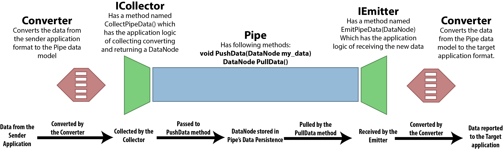

# Geometry Exchange with "ThePipe" #

The Pipe is a series of plugins and extensions for various design and
modeling applications intended to provide a channel for real time
communication of geometry between these applications. It can also be
used for real-time communication over a network between two
machines. ThePipe is written to be flexible and easily extensible. As
of now, only 4 applications are supported - Rhinoceros, Revit,
Grasshopper and Dynamo.

This is a project under development and any contributions / ideas are
always welcome.

## The Data Model ##
The Pipe has its own data model used to transfer data. The data is
converted from the application's native format into the PipeDataModel,
communicated with the Pipe's counter part extension in the target
application, which then converts the data into the native types of the
target application.

All types communicated over the pipe implement the IPipeMemberType
interface. ThePipe communicates the data in a tree data structure. You
can also have your own data types that implement this interface sent
over ThePipe.

## Implementing new Pipes ##
All implementations of Pipe should have 3 methods (maybe different in
the future, but the basic idea remains the same):
```
// This method should send the given data tree over the pipe.
void PushData(DataNode node);
// This should pull the data tree being sent over the pipe.
DataNode PullData();
// This is should close the pipe connection and free up any
// that were being used by the pipe.
void ClosePipe();
```
The implementations of these methods determine the exact mechanism of
communication. The simplest implementations of the pipe in this repo
use the ```NamedPipeServerStream``` to achieve interprocess
communication. A demo implementation of the WebPipe sends the data to
a url and can communicate it to other machines. But you are free to
write your own pipe implementations.

## Writing Pipe Extensions for other applications ##
The ends of the pipe, i.e. the parts that send and receive the data
from / to applications are classed that implement the IPipeCollector
(the sending application side) and IPipeEmitter (the receiving
application side) interfaces. The IPipeCollector interface enforces
methods to collect data from the application in its native format,
converting it into the PipeDataModel and returning it. Similarly, The
IPipeEmitter interface enforces methods that receive the data tree
consisting of PipeDataModel objects, converting them into the native
formats of the target application and delivering it to the user.

As long as these basic requirements are met, how the data is
collected, converted and delivered is up to the specific
implementations. But for convenience, the data model of ThePipe also
comes with PipeConverter class, which can simplify the daunting task
of data conversion by being able to automatically traverse inheritance
trees of the source and target types of the conversion. You can look
at the code to understand more clearly how it works.

## Everything works together ##
When all the components described above are implemented and working
properly, they can work together as shown by the schematic below.



