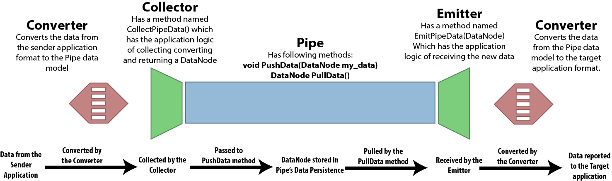

Geometry Exchange with "The Pipe"
=================================

The Pipe is a series of plugins and extensions for various design and
modeling applications intended to provide a channel (pipe?) real time
communication of geometry between these applications. The data model for
the pipe and the pipe itself are written to be very flexible to allow
other developers to inherit from these classes and write their own
concrete implementations of the pipe, other than the ones that come with
the pipe. At this point, I am writing extensions for 4 applications,
Rhinoceros, Revit, Grasshopper and Dynamo. You can find these individual
projects in the folders named after them.

This is still under development and not ready for distribution. If you
want to try the Pipe for yourself, then watch this video:
<https://www.youtube.com/watch?v=20S1--5kT98&t=9s>

If you are interested in developing your own application extensions or
implementations of the pipe, please read this document, or watch this
video:

<https://www.youtube.com/watch?v=k8w2NICcN7s&t=231s>

**The Data Model**

The Pipe has its own classes for various types of geometry. You can go
through those classes and their inheritance trees by browsing the
*PipeDataModel/Types/* folder. Support for more geometry types is being
added at the moment so the contents of that folder will be changing.

All these classes implement one interface, IPipeMemberType. And when the
data goes through the pipe, it is organized in a tree data structure, as
a DataNode (PipeDataModel.DataTree) object. Every DataNode object has a
name, a value which is an IPipeMemberType and a list of Children
DataNode objects. A tree data structure is flexible because you can send
data with any dimensionality, one piece of data as a single node, a list
of data as an empty node with a set of children nodes, and a list of
lists as a tree of depth 2 and so on.

You can implement your own datatypes to be communicated over the pipe as
long as they implement the IPipeMemberType interface. If you are writing
a Pipe extension for a new application, please make sure to pack the
data to be sent as a tree into a single DataNode object.

**Implementing new Pipes**

All implementations of the Pipe should inherit from the Pipe base class
(PipeDataModel.Pipe).

This requires the concrete classes to implement the following methods:

-   void PushData(DataNode node)

-   DataNode PullData()

-   Void ClosePipe()

The implementations of these methods determine the exact mechanism by
which the pipe communicates the data. For example, In the LocalNamedPipe
class, which inherits from the Pipe base class, the PushData method
serializes the DataNode to a byte array and stores it in the computer's
memory through a NamedPipeServerStream. The PullData method reads the
data from memory through a NamedPipeClientStream, deserializes it and
returns it. These same methods the WebPipe implementation send POST and
GET requests to the given url. If you desire so, you can implement a new
pipe that plays the data from the speakers and have the PullData method
listen for it with a microphone. You also have to implement a method
named ClosePipe() this is meant to clean up any persistent resource that
the pipe uses, that needs to be cleaned up.

**Writing Pipe Extensions for Other Applications**

If you want to write pipe extensions for applications that are not
currently supported, then you have to have classes that implement the
IPipeCollector and IPipeEmitter interfaces.

The class that implements the IPipeCollector interface will have to
implement the CollectPipeData method. This method should have the logic
of getting the geometry data from the application (the ones that the
user wants to send over the pipe), converting the application format
geometry to one of the IPipeMemberTypes, and then packing all the
IPipeMemberType instances into a single DataNode, which is returned by
the CollectPipeData method.

The class that implements the IPipeEmitter interface will have
EmitPipeData method. This method receives a DataNode as a parameter and
it should contain the logic needed to convert the IPipeMemberType
instances packed into the DataNode to application geometry types, and
then report that geometry to the application (to the user as the data
received from the pipe).

There are two conversion steps, one is converting application geometry
to IPipeMemberType instances when sending the data, and then from
IPipeMemberType instances to target application geometry formats on the
receiving side. This can be done with any kind of logic as long as it
works, but I recommend using classes that inherit from PipeConverter. A
PipeConverter object consists of several child converters, each of which
contain several child converters and so on like a tree data structure,
until we reach the leaf nodes, which contain delegates that can convert
data in both directions. This tree like organization of conversion logic
is a direct reflection of the inheritance trees of both the application
data models and the pipe data models between which the conversion is
meant to happen. Organizing the conversion logic as delegates in this
tree like structure allows the logic of traversing the inheritance tree
to be abstract, and it can be written only once, less prone to mistakes
and errors. A much clearer explanation of this process is provided in
the "Pipe for Developers" video linked at the top of this document.

**It all comes together**

This schematic explains how it all comes together to make the pipe work.

